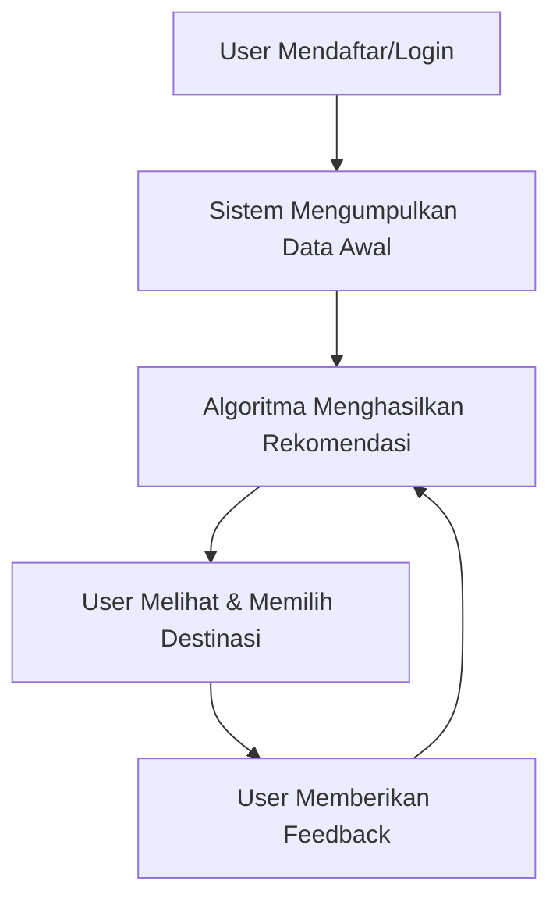

# TravelNesia 🌏

**TravelNesia** adalah platform rekomendasi wisata pintar yang membantu pengguna menemukan destinasi wisata di seluruh Indonesia berdasarkan lokasi, preferensi, dan penilaian pengguna lainnya. Sistem ini mempromosikan destinasi lokal yang kurang dikenal dan meningkatkan pengalaman berwisata secara personal.

## 📋 Daftar Isi
- [Tujuan Utama](#-tujuan-utama)
- [Fitur Utama](#-fitur-utama)
- [Demo Cara Kerja](#-demo-cara-kerja)
- [Teknologi yang Digunakan](#-teknologi-yang-digunakan)
- [Instalasi & Setup](#️-instalasi--setup)
- [Struktur Repositori](#-struktur-repositori)
- [Testing](#-testing)

---

## 🎯 Tujuan Utama

1. **Rekomendasi Real-time** - Memberikan rekomendasi tempat wisata real-time yang sesuai dengan preferensi pengguna
2. **Promosi Wisata Lokal** - Mempromosikan wisata lokal dan daerah terpencil yang belum banyak dikenal
3. **Machine Learning** - Memanfaatkan machine learning untuk hasil rekomendasi yang akurat dan personal

---

## 🚀 Fitur Utama

### 📍 Personalisasi Berdasarkan Histori & Lokasi
Rekomendasi tempat wisata dikalkulasi dengan memperhatikan lokasi pengguna saat ini dan histori kunjungan sebelumnya.

### ⭐ Sistem Rating & Review Terpadu
Pengguna dapat memberikan rating dan menulis review. Sistem menggunakan data ini untuk meningkatkan kualitas rekomendasi.

### 🤖 Machine Learning
- **Collaborative Filtering** - Menemukan pengguna dengan kesukaan serupa
- **Content-based Filtering** - Menyesuaikan rekomendasi berdasarkan detail destinasi
- **Clustering Destinasi** - Analisis grouping berdasarkan karakteristik destinasi

### 💻 Web Responsive Modern
Dibangun menggunakan React.js + Tailwind CSS untuk front-end dengan responsive design yang optimal.

### 🔧 API Backend
Dirancang dengan Express.js untuk mengelola logika rekomendasi dan routing yang efisien.

### 🗄️ Database Non-Relasional
MongoDB digunakan sebagai database untuk menyimpan data pengguna, destinasi, rating, dan histori.

---

## 🎬 Demo Cara Kerja



1. **User mendaftar/login** - Email + password atau social login
2. **Sistem mengumpulkan data awal** - Lokasi (via browser/mobile), histori kunjungan, preferensi wisata
3. **Algoritma menghasilkan rekomendasi** - Kombinasi filtering otomatis mengurutkan destinasi dari yang paling relevan
4. **Pengguna melihat & memilih destinasi** - Tampilan card tempat wisata lengkap dengan foto, rating, jarak, dan detail
5. **Feedback pengguna** - Rating dan review untuk meningkatkan akurasi rekomendasi di masa depan

---

## 🛠️ Teknologi yang Digunakan

### Frontend
- React.js
- Tailwind CSS
- Axios

### Backend
- Node.js
- Express.js
- JWT Authentication

### Database
- MongoDB

### Machine Learning
- Collaborative Filtering
- Content-based Filtering
- Clustering Algorithms

---

## ⚙️ Instalasi & Setup

### Prasyarat
- Node.js (v16+)
- npm atau yarn
- MongoDB (lokal atau Atlas)

### Langkah Instalasi

```bash
# Clone repository
git clone https://github.com/as-arthur/TravelNesia.git
cd TravelNesia

# Install dependencies frontend
cd frontend
npm install

# Install dependencies backend
cd ../backend
npm install

# Konfigurasi environment variables
# Buat file .env di folder backend dengan isi:
# MONGO_URI=your_mongodb_uri
# JWT_SECRET=your_secret_key
# FRONTEND_URL=http://localhost:3000

# Jalankan backend server
cd backend
npm start

# Jalankan frontend (terminal baru)
cd frontend
npm start
```

Aplikasi akan berjalan di:
- Frontend: `http://localhost:3000`
- Backend: `http://localhost:5000`

---

## 📁 Struktur Repositori

```
TravelNesia/
├── backend/
│   ├── models/           # Skema MongoDB: User, Destination, Rating
│   ├── routes/           # API Endpoints (auth, destinasi, rating)
│   ├── controllers/      # Logic controllers
│   ├── services/         # Logika rekomendasi & algoritma ML
│   ├── middleware/       # Authentication & validation
│   ├── config/           # Database & app configuration
│   └── server.js         # Entry point backend
├── frontend/
│   ├── src/
│   │   ├── components/   # UI components (cards, navbar, dll)
│   │   ├── pages/        # Halaman (Home, Detail, Profile)
│   │   ├── hooks/        # Custom React hooks
│   │   ├── utils/        # Utility functions
│   │   └── api.js        # Axios config & API calls
│   ├── public/           # Static assets
│   └── tailwind.config.js
├── docs/                 # Dokumentasi tambahan
├── tests/                # Test files
└── README.md
```

---

## 🧪 Testing

### Unit Tests (Backend)
```bash
cd backend
npm test
```

### Manual Testing (Frontend)
1. Jalankan aplikasi di localhost
2. Coba fitur register dan login
3. Lihat rekomendasi destinasi
4. Berikan rating dan review
5. Verifikasi perubahan rekomendasi berdasarkan feedback

### Integration Tests
```bash
# Jalankan semua tests
npm run test:all
```

---

*README ini bertujuan memberikan gambaran lengkap tentang fitur, cara kerja, dan cara menjalankan TravelNesia. Untuk dokumentasi teknis yang lebih detail, silakan kunjungi folder `/docs`.*